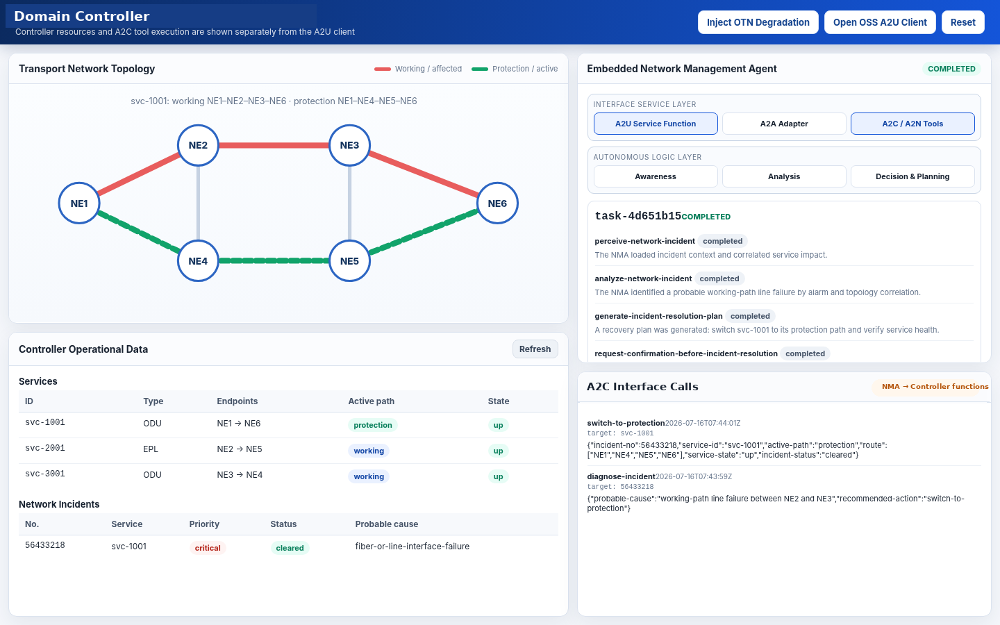

# NMA A2U Interface

This repository contains the Internet-Draft, extracted YANG module, and IETF 126
Hackathon demonstration for the **Agent-to-User (A2U) interface of a Network
Management Agent (NMA)**.

A2U is a user-facing interface through which a **non-agent upper-layer system or
user**—such as an OSS/BSS, orchestrator, management portal, automation system,
or human-facing application—discovers and invokes NMA capabilities. Interaction
between two agents or NMAs is outside the scope of A2U and is expected to use
A2A or another Agent-to-Agent interface. While A2A interactions may reuse or map
the same semantics defined by A2U.


## Internet-Drafts

- [Framework and YANG Data Model for the NMA A2U Interface](https://datatracker.ietf.org/doc/draft-zhao-nmop-nma-a2u-yang/)
- [Network Management Agent concepts and architecture](https://datatracker.ietf.org/doc/draft-zhao-nmop-network-management-agent/)

The exact submitted TXT used as the repository baseline is stored at:

- [`drafts/draft-zhao-nmop-nma-a2u-yang-00.txt`](drafts/draft-zhao-nmop-nma-a2u-yang-00.txt)

The YANG module extracted from Section 8.3 is stored at:

- [`yang/ietf-nma-a2u.yang`](yang/ietf-nma-a2u.yang)

## A2U model coverage

The YANG module contains:

- operational state for `agent-capabilities`, `intent`, `task`, and `confirmation`;
- the `submit-intent`, `resolve-confirmation`, and `abort-task` RPCs;
- the `a2u-task-notification` YANG notification;
- natural-language and structured intent modes;
- the structured intent categories `CREATE`, `DELETE`, `MODIFY`, `QUERY`,
  `REPORT`, `DIAGNOSE`, `REMEDIATE`, `OPTIMIZE`, and `ASSURE`;
- plan exposure, human-in-the-loop confirmation, task result exposure, and
  consistent error information.

Domain-specific information is carried through `anydata` fields and associated
schema identifiers. The incident scenario reuses information aligned with the
`ietf-incident` model rather than redefining the incident data model in A2U.

## IETF 126 Hackathon demo

The [`IETF126-hackathon-demo`](IETF126-hackathon-demo/) directory contains a deterministic,
self-contained implementation of the A2U workflow.

### System composition

1. **OSS/BSS Simulator — A2U Client**  
   A non-agent upper-layer system that discovers NMA capabilities, submits
   natural-language or structured intents, accesses operational objects,
   receives task notifications, and resolves confirmation requests.

2. **Domain Controller with an embedded NMA — A2U Server**  
   The NMA interprets the intent, gathers controller context, performs analysis
   and planning, requests confirmation, invokes controller functions, verifies
   execution results, and reports task feedback.

### OSS/BSS A2U Client


### Domain Controller and embedded NMA



### A2C function-call record


## Primary incident workflow

The main demonstration uses an OTN service degradation incident to show why the
A2U `intent`, `task`, `plan`, `confirmation`, and notification objects are
needed:

1. The OSS discovers the NMA's advertised skills and policies.
2. The OSS invokes `submit-intent` using natural-language or structured input.
3. The NMA creates an intent and a task.
4. Through internal A2C functions, the NMA retrieves the incident, affected
   service, alarms, and topology.
5. The NMA correlates this context, identifies a probable cause, and generates a
   recovery plan.
6. The NMA pushes `plan-generated` and `confirmation-required` notifications.
7. The OSS reads the confirmation object and invokes `resolve-confirmation`.
8. After approval, the NMA invokes the Domain Controller to switch the affected
   service to its protection path and verify service recovery.
9. The NMA pushes progress/completion notifications and exposes the final task
   result.

The demonstration deliberately pauses between stages so the processing flow is
visible during a live presentation. The base interval can be changed through
`A2U_DEMO_DELAY_SECONDS`.

## Secondary service-creation workflow

The structured `CREATE` scenario retains the original service-provisioning use
case. It also demonstrates `modify-and-approve`, allowing editable service
parameters to be changed before execution, such as endpoints, ports, bandwidth,
and protection/recovery type.

## Implemented A2U interface

### Operational state

| Purpose | RESTCONF-style access |
|---|---|
| Capability discovery | `GET /restconf/data/ietf-nma-a2u:a2u/agent-capabilities` |
| Intent state | `GET /restconf/data/ietf-nma-a2u:a2u/intent[={intent-id}]` |
| Task state | `GET /restconf/data/ietf-nma-a2u:a2u/task[={task-id}]` |
| Confirmation state | `GET /restconf/data/ietf-nma-a2u:a2u/confirmation[={confirmation-id}]` |

### RPCs

| RPC | RESTCONF-style invocation |
|---|---|
| Submit intent | `POST /restconf/operations/ietf-nma-a2u:submit-intent` |
| Resolve confirmation | `POST /restconf/operations/ietf-nma-a2u:resolve-confirmation` |
| Abort task | `POST /restconf/operations/ietf-nma-a2u:abort-task` |

The A2U-focused OpenAPI page provides pre-populated natural-language and
structured `submit-intent` request examples.

### Notifications

The demo implements the notification content defined by the draft:

- `plan-generated`;
- `confirmation-required`;
- `step-completed`;
- `step-failed`;
- `task-completed`;
- `task-failed`.

Subscription establishment and delivery follow the dynamic-subscription model:
a subscription is established once and the NMA subsequently pushes YANG
notifications over the subscription channel. The OSS does not periodically poll
for notification messages. Task objects are refreshed on received notifications
or by explicit user action, not by continuous task polling.

## A2C demonstration boundary

The Domain Controller exposes functions such as:

- `get-incident`;
- `get-service`;
- `get-alarms`;
- `get-topology`;
- `update-incident-analysis`;
- `switch-to-protection`;
- `verify-service`.

The controller provides data access and execution. Intent interpretation,
context correlation, analysis, decision-making, planning, confirmation handling,
and result evaluation remain NMA responsibilities.

## Quick start

```bash
cd IETF126-hackathon-demo
python -m venv .venv

# Windows
.venv\Scripts\activate

# Linux/macOS
source .venv/bin/activate

pip install -r requirements.txt
python app.py
```

Open:

- Domain Controller: <http://127.0.0.1:8000/>
- OSS/BSS A2U Client: <http://127.0.0.1:8000/oss>
- A2U-only OpenAPI documentation: <http://127.0.0.1:8000/docs>

The demo is deterministic and does not require an external LLM or Internet
connection.

To adjust pacing:

```bash
A2U_DEMO_DELAY_SECONDS=1.8 python app.py
```

PowerShell:

```powershell
$env:A2U_DEMO_DELAY_SECONDS="1.8"
python app.py
```

## Validation

Run the demo tests:

```bash
cd IETF126-hackathon-demo
python tests/smoke_test.py
python tests/api_contract_test.py
```

Run the repository consistency check:

```bash
python scripts/validate_repo.py
```

Regenerate the YANG file from the final draft TXT:

```bash
python scripts/extract_yang.py
```

For full standards-oriented YANG validation, install `pyang` or `yanglint` and
validate `yang/ietf-nma-a2u.yang` together with its imported IETF modules.

## Repository structure

```text
.
├── README.md
├── .gitignore
├── drafts/
│   └── draft-zhao-nmop-nma-a2u-yang-00.txt
├── yang/
│   └── ietf-nma-a2u.yang
├── IETF126-hackathon-demo/
│   ├── agent.py
│   ├── app.py
│   ├── controller.py
│   ├── frontend/
│   ├── data/
│   ├── tests/
│   ├── requirements.txt
│   └── README.md
├── docs/
│   └── images/
│       ├── oss-a2u-client.png
│       ├── oss-a2u-overview.png
│       ├── domain-controller.png
│       └── a2c-interface-calls.png
└── scripts/
    ├── extract_yang.py
    └── validate_repo.py
```

## Implementation note

The RESTCONF-style paths and JSON payloads in the demo illustrate the A2U YANG
model and its interaction workflow. `/api/demo/*`, local JSON persistence, and
other UI-support functions are implementation aids for the Hackathon and are
not additional A2U protocol definitions.
